<h2>Tensorflow-Image-Segmentation-Cardiac-Acquisitions (2024/02/05)</h2>

This is an experimental Image Segmentation project for Cardiac-Acquisitions based on
the <a href="https://github.com/sarah-antillia/Tensorflow-Image-Segmentation-API">Tensorflow-Image-Segmentation-API</a>
and an augmented CAMUS_public (Cardiac Acquisitions for Multi-structure Ultrasound Segmentation) dataset.  
Please see also <a href="https://github.com/atlan-antillia/CAMUS_public-ImageMask-Dataset">CAMUS_public-ImageMask-Dataset.</a> 

As a first trial, we use the simple UNet Model 
<a href="./src/TensorflowUNet.py">TensorflowSlightlyFlexibleUNet</a> for this Cardiac-Acquisitions Segmentation. 
As shown in <a href="https://github.com/sarah-antillia/Tensorflow-Image-Segmentation-API">Tensorflow-Image-Segmentation-API</a>.
you may try other Tensorflow UNet Models: 

<li><a href="./src/TensorflowSwinUNet.py">TensorflowSwinUNet.py</a></li>
<li><a href="./src/TensorflowMultiResUNet.py">TensorflowMultiResUNet.py</a></li>
<li><a href="./src/TensorflowAttentionUNet.py">TensorflowAttentionUNet.py</a></li>
<li><a href="./src/TensorflowEfficientUNet.py">TensorflowEfficientUNet.py</a></li>
<li><a href="./src/TensorflowUNet3Plus.py">TensorflowUNet3Plus.py</a></li>
 

 

<h3>1. Dataset Citation</h3>
<a href="https://www.creatis.insa-lyon.fr/Challenge/camus/databases.html">
CAMUS 
Cardiac Acquisitions for Multi-structure Ultrasound Segmentation 
</a>
 
<b>
Dataset properties
</b> 
<pre>
The overall CAMUS dataset consists of clinical exams from 500 patients, acquired at the University 
Hospital of St Etienne (France) and included in this study within the regulation set by the local 
ethical committee of the hospital after full anonymization. 
The acquisitions were optimized to perform left ventricle ejection fraction measurements. 
In order to enforce clinical realism, neither prerequisite nor data selection have been performed. Consequently,

・some cases were difficult to trace;</li>
・the dataset involves a wide variability of acquisition settings;
・for some patients, parts of the wall were not visible in the images;
・for some cases, the probe orientation recommendation to acquire a rigorous four-chambers
view was simply impossible to follow and a five-chambers view was acquired instead.
This produced a highly heterogeneous dataset, both in terms of image quality and pathological cases, 
which is typical of daily clinical practice data.

The dataset has been made available to the community HERE.
The dataset comprises : 
i) a training set of 450 patients along with the corresponding manual references based on 
the analysis of one clinical expert; 
ii) a testing set composed of 50 new patients. 
The raw input images are provided through the raw/mhd file format.
</pre>
 
This work has published to IEEE TMI journal. <b>You must cite this paper for any use of the CAMUS database</b>. 

S. Leclerc, E. Smistad, J. Pedrosa, A. Ostvik, et al. 
"Deep Learning for Segmentation using an Open Large-Scale Dataset in 2D Echocardiography" in  
IEEE Transactions on Medical Imaging, vol. 38, no. 9, pp. 2198-2210, Sept. 2019. 
 
doi: 10.1109/TMI.2019.2900516 
 

<h3>
<a id="2">
2 Cardiac-Acquisitions ImageMask Dataset
</a>
</h3>
 If you would like to train this Cardiac-Acquisitions Segmentation model by yourself,
 please download the  
 augmented dataset of image-size 512x512 from the google drive 
<a href="https://drive.google.com/file/d/1ckzga8X5Zmjl_PDQNf1ni8-3GhrcDlIo/view?usp=sharing">
CAMUS_public-ImageMask-Dataset.zip</a>

Please see also the <a href="https://github.com/atlan-antillia/CAMUS_public-ImageMask-Dataset">CAMUS_public-ImageMask-Dataset</a>. 
Please expand the downloaded ImageMaskDataset and place them under <b>./dataset</b> folder to be

<pre>
./dataset
└─Cardiac-Acquisitions
    ├─test
    │  ├─images
    │  └─masks
    ├─train
    │  ├─images
    │  └─masks
    └─valid
        ├─images
        └─masks
</pre>
 
Please run the following bat file to count the number of images in this dataset. 
<pre>
dataset_stat.bat
</pre> 
, which generates the following <b>Cardiac-Acquisitions_Statistics.png</b> file. 
<b>Cardiac-Acquisitions_Statistics</b> 
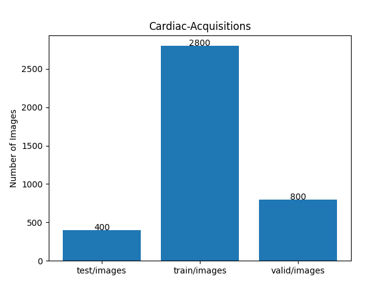 

<h3>
<a id="3">
3 TensorflowSlightlyFlexibleUNet
</a>
</h3>
This <a href="./src/TensorflowUNet.py">TensorflowUNet</a> model is slightly flexibly customizable by a configuration file. 
For example, <b>TensorflowSlightlyFlexibleUNet/Cardiac-Acquisitions</b> model can be customizable
by using <a href="./projects/TensorflowSlightlyFlexibleUNet/Cardiac-Acquisitions/train_eval_infer.config">
train_eval_infer.config.</a>
<pre>
; train_eval_infer.config
; 2024/02/05 (C) antillia.com

[model]
model          = "TensorflowUNet"
;base_kernels   = (5,5)
dilation       = (2,2)
image_width    = 512
image_height   = 512
image_channels = 3
num_classes    = 1
base_filters   = 16
num_layers     = 8
dropout_rate   = 0.08
learning_rate  = 0.0001

loss           = "bce_iou_loss"
;loss           = "binary_crossentropy"
metrics        = ["binary_accuracy"]
;loss         = "basnet_hybrid_loss"
;metrics      = ["dice_coef"]

show_summary   = False

[train]
epochs        = 100
batch_size    = 2
patience      = 10
metrics       = ["binary_accuracy", "val_binary_accuracy"]
;metrics       = ["dice_coef", "val_dice_coef"]

model_dir     = "./models"
eval_dir      = "./eval"

image_datapath = "../../../dataset/Cardiac-Acquisitions/train/images/"
mask_datapath  = "../../../dataset/Cardiac-Acquisitions/train/masks/"

[eval]
image_datapath = "../../../dataset/Cardiac-Acquisitions/valid/images/"
mask_datapath  = "../../../dataset/Cardiac-Acquisitions/valid/masks/"

[infer] 
images_dir    = "../../../dataset/Cardiac-Acquisitions/test/images/"
output_dir    = "./test_output"
merged_dir    = "./test_output_merged"
green_mask    = True

[mask]
blur      = True
binarize  = True
threshold = 76
</pre>

<h3>
3.1 Training
</h3>
Please move to a <b>./projects/TensorflowSlightlyFlexibleUNet/Cardiac-Acquisitions</b> folder, 
and run the following bat file to train TensorflowUNet model for Cardiac-Acquisitions. 
<pre>
./1.train.bat
</pre>
<pre>
python ../../../src/TensorflowUNetTrainer.py ./train_eval_infer.config
</pre>
Train console output: 
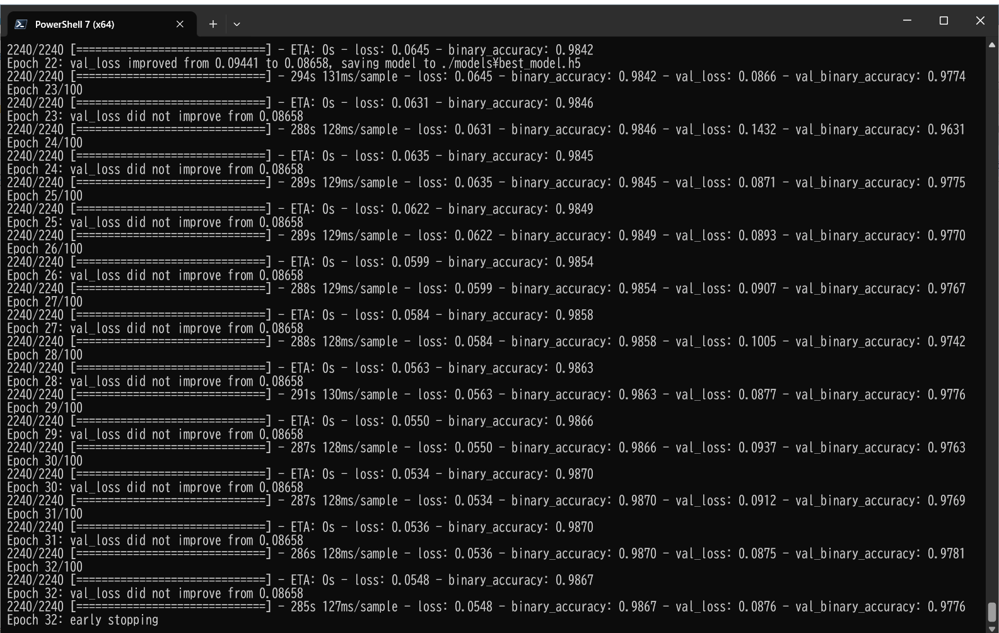 
 

Train metrics: 
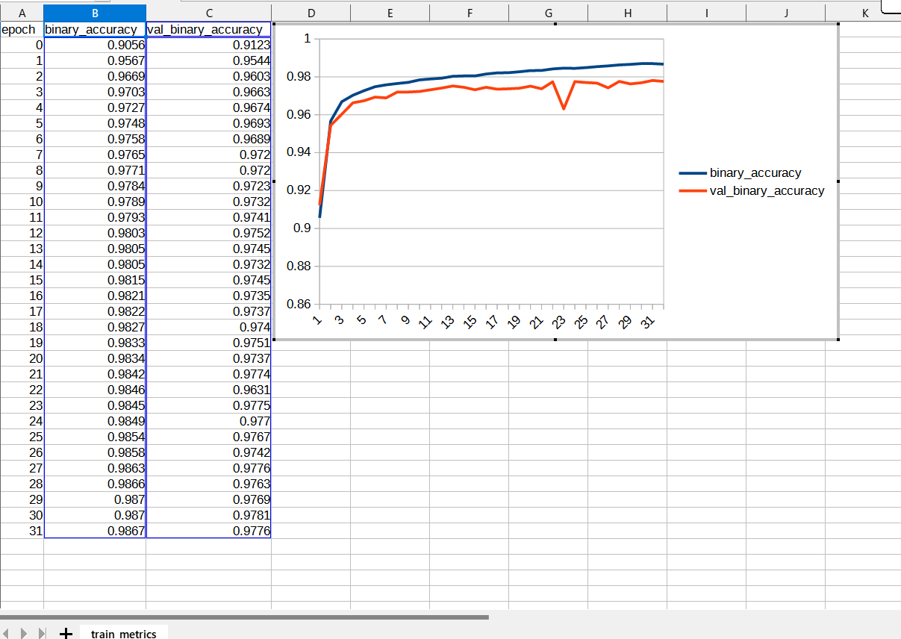 
 
Train losses: 
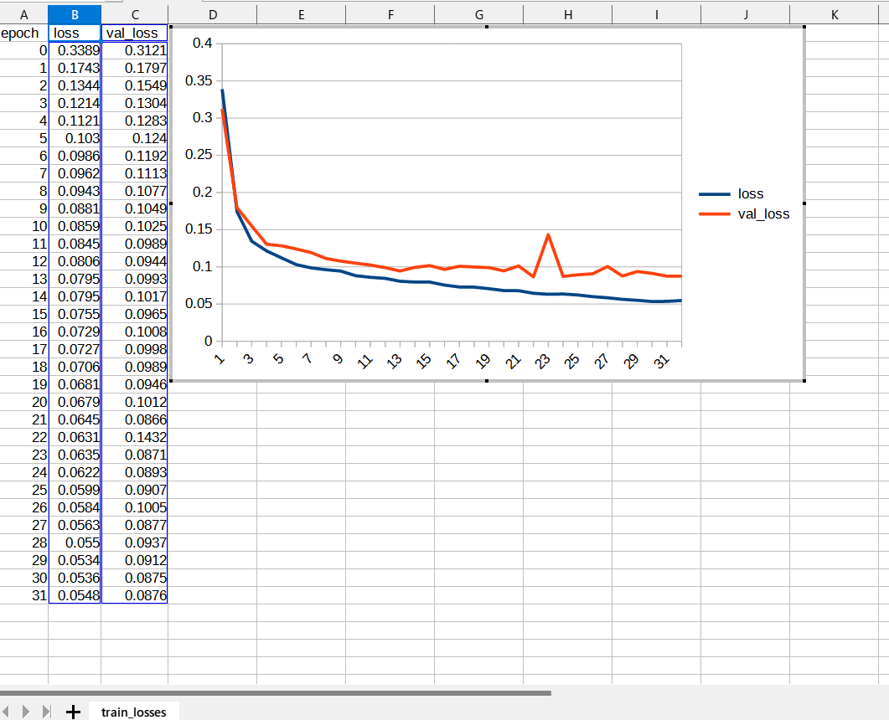 
 
<h3>
3.2 Evaluation
</h3>
Please move to a <b>./projects/TensorflowSlightlyFlexibleUNet/Cardiac-Acquisitions</b> folder, 
and run the following bat file to evaluate TensorflowUNet model for Cardiac-Acquisitions. 
<pre>
./2.evaluate.bat
</pre>
<pre>
python ../../../src/TensorflowUNetEvaluator.py ./train_eval_infer.config
</pre>
<b>Evaluation console output:</b> 
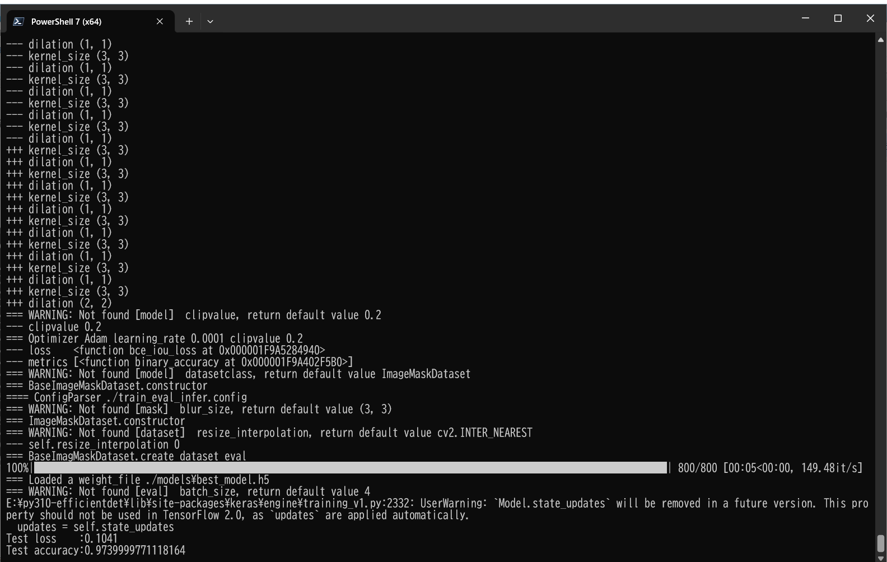 
As shown above, the accuracy 0.9740 for <b>valid</b> dataset is high. 

<h2>
3.3 Inference
</h2>
Please move to a <b>./projects/TensorflowSlightlyFlexibleUNet/Cardiac-Acquisitions</b> folder 
,and run the following bat file to infer segmentation regions for images by the Trained-TensorflowUNet model for Cardiac-Acquisitions. 
<pre>
./3.infer.bat
</pre>
<pre>
python ../../../src/TensorflowUNetInferencer.py ./train_eval_infer.config
</pre>
Sample test images 
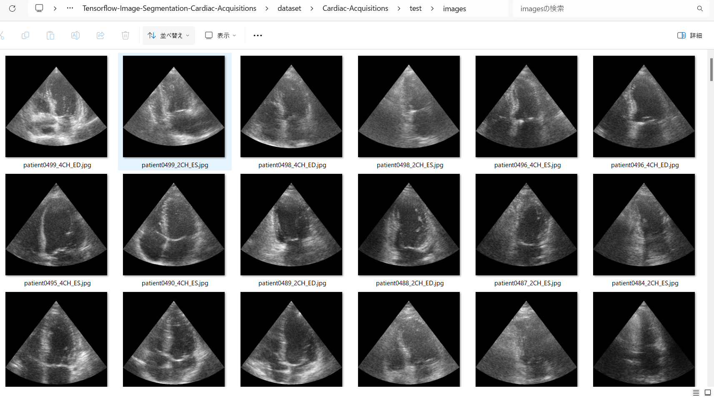 
Sample test mask 
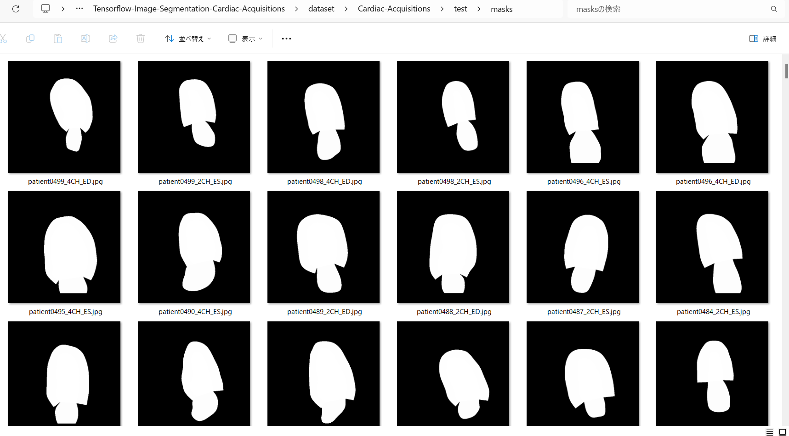 

 
Inferred test masks 
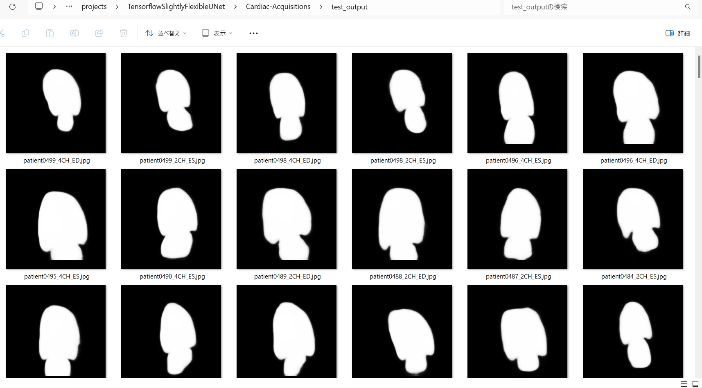 
 
Merged test images and inferred masks  
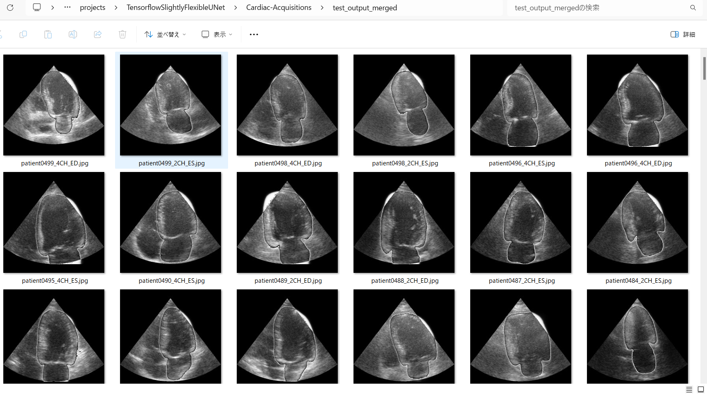  

Enlarged samples 
<table>
<tr>
<td>
test/images/patient0010_2CH_ES.jpg 
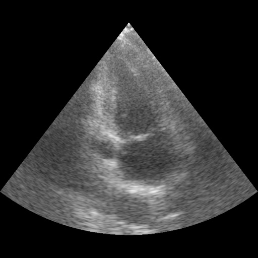

</td>
<td>
Inferred merged/patient0010_2CH_ES.jpg 
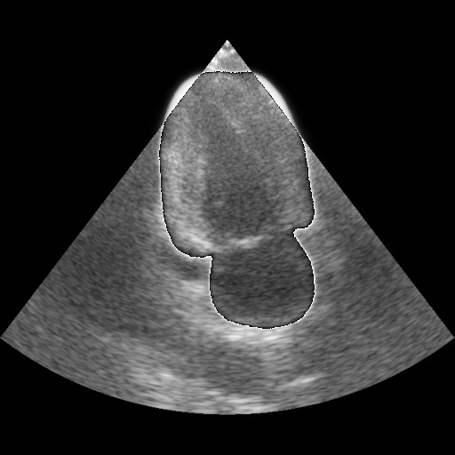
</td> 
</tr>

<tr>
<td>
test/images/patient0019_4CH_ED.jpg 
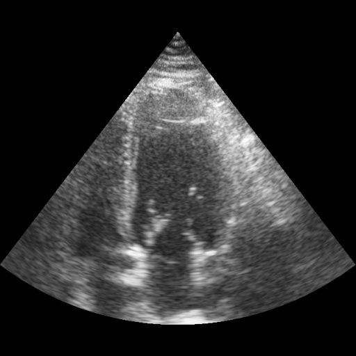

</td>
<td>
Inferred merged/patient0019_4CH_ED.jpg 

</td> 
</tr>

<tr>
<td>
test/images/patient0034_2CH_ES.jpg 
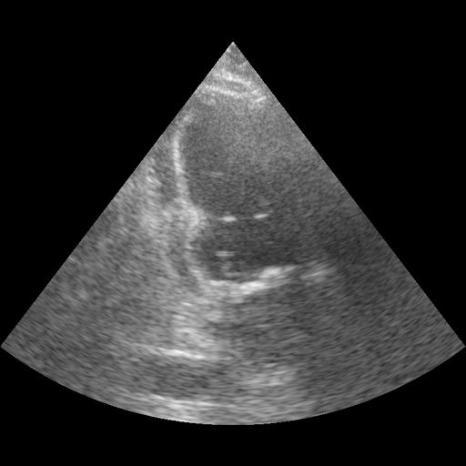

</td>
<td>
Inferred merged/patient0034_2CH_ES.jpg 

</td> 
</tr>

<tr>
<td>
test/images/patient0049_2CH_ES.jpg 
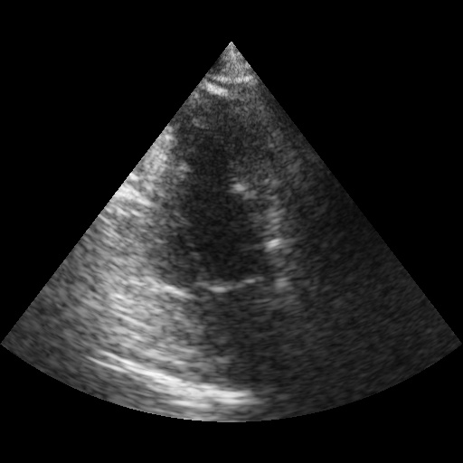

</td>
<td>
Inferred merged/patient0049_2CH_ES.jpg 
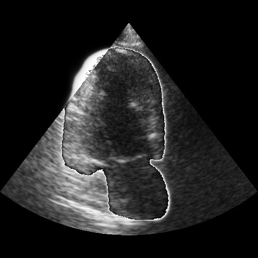
</td> 
</tr>

<tr>
<td>
test/images/mirrored_patient0079_2CH_ED.jpg 
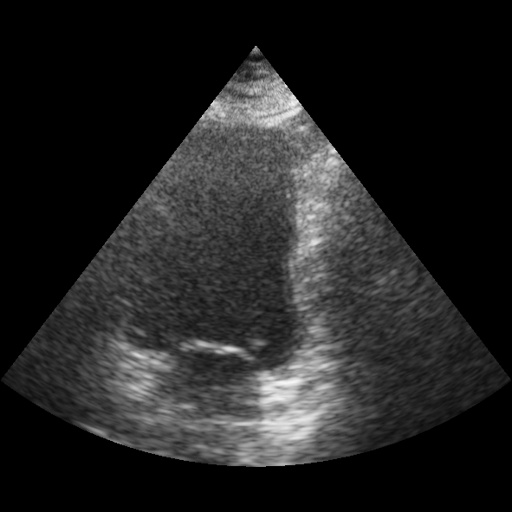

</td>
<td>
Inferred merged/mirrored_patient0079_2CH_ED.jpg 
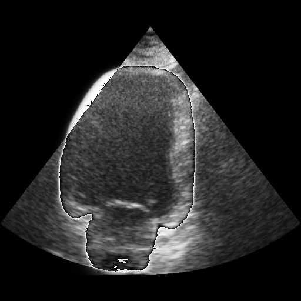
</td> 
</tr>
</table>

<h3>
References
</h3>
<b>1. Deep Learning for Segmentation using an Open Large-Scale Dataset in 2D Echocardiography</b> 
Sarah Leclerc, Erik Smistad, Joao Pedrosa, Andreas Østvik, Frederic Cervenansky, Florian Espinosa,  
Torvald Espeland, Erik Andreas Rye Berg, Pierre-Marc Jodoin, Thomas Grenier, Carole Lartizien, Jan D’hooge, 
Lasse Lovstakken, and Olivier Bernard  
<pre>
https://www.creatis.insa-lyon.fr/Challenge/camus/files/tmi_2019_leclerc.pdf
</pre>

<b>2. Improved UNet with Attention for Medical Image Segmentation</b> 
Ahmed AL Qurri and Mohamed Almekkawy  
Sensors 2023, 23(20), 8589; https://doi.org/10.3390/s23208589 
<pre>
https://www.mdpi.com/1424-8220/23/20/8589
</pre>

